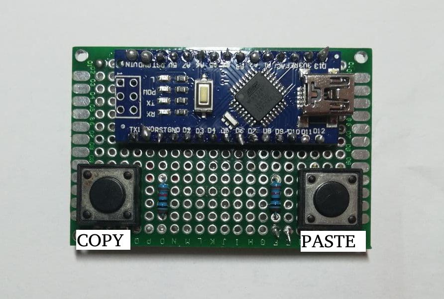

# External Copy & Paste Buttons

## Final result
The final result, with all soldering finished, is presented in the image below


## Why?
This simple project can help you to speed up your __copy & paste operations__. It allows you to use a single external button instead of using the boring classic key combinations such as _Ctrl+C_ or _Ctrl+V_.

## What do you need?
| Quantity  | Description  |   
|---|---|
|1   | Arduino   |
|2   | Button |
|2   | 10K Ohm Resistor  |

## Hardware setup
The setup is very simple:
Connect the buttons to Arduino with the [resistors in __pull-up configuration__](https://www.hackster.io/najad/3-different-ways-of-connecting-a-push-button-to-arduino-24771a) and using the following Arduino pins:
| Button  | Digital Pin  |   
|---|---|
|Copy   | 2   |
|Paste  | 7 |

Below there is an image of the setup.


## Dependencies
* [pyserial](https://pythonhosted.org/pyserial/)
* [pynput](https://pynput.readthedocs.io/en/latest/)

## Usage
To use finally the buttons you should:
* Load the __arduino_control.ino__ sketch in your Arduino
* Change some parameters (if you need to do some changes) in the __setup.py__ script.
* Run the __main_linux.py__ script if your OS is Linux:
    ```
    python main_linux.py
    ```
* Run the __main_windows.py__ script if your OS is Windows:
    ```
    python main_windows.py
    ```

## Future Goals
In the future i would like to insert a GUI for a better management of the
serial connection and i would like to increase the number of available buttons
(Ex: Ctrl+Z, etc...)
